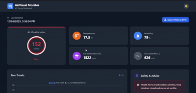

# 🌬️ AirVisual Monitor - IoT Sensor Dashboard

> A real-time air quality monitoring dashboard that visualizes environmental metrics from IoT sensors, helping users make informed decisions about their air quality exposure.

[](https://opensource.org/licenses/MIT)
[](https://reactjs.org/)
[](https://firebase.google.com/)

---

## 📸 Project Preview



> *Add a screenshot or GIF of your dashboard in action*

---

## ✨ Features

- 🔄 **Real-Time Data Synchronization** - Live updates from Firebase Realtime Database with minimal latency
- 📊 **Interactive Visualizations** - Dynamic line charts and gauges powered by Chart.js/Recharts
- 🎯 **Air Quality Index (AQI) Monitoring** - US EPA standard AQI calculation and display
- 🌡️ **Environmental Metrics** - Track temperature, humidity, PM2.5, PM10, and gas levels (MQ-135, MQ-2)
- 💡 **Smart Health Recommendations** - Context-aware alerts and safety suggestions based on current AQI
- 📱 **Fully Responsive Design** - Seamless experience across mobile, tablet, and desktop devices
- 📥 **Data Export** - Download historical data in CSV format for further analysis
- 🎨 **Modern UI/UX** - Clean, intuitive interface with dark mode support

---

## 🛠️ Tech Stack

| Technology | Purpose |
|------------|---------|
| **React.js** | Frontend framework |
| **JavaScript (ES6+)** | Core programming language |
| **HTML5 & CSS3** | Markup and styling |
| **Firebase Realtime Database** | Backend data storage and real-time sync |
| **Chart.js / Recharts** | Data visualization library |
| **Tailwind CSS / Bootstrap** | UI component styling |

---

## 🚀 Installation & Setup

### Prerequisites

- Node.js (v14.x or higher)
- npm or yarn package manager
- Firebase account with Realtime Database enabled

### Step 1: Clone the Repository

```bash
git clone https://github.com/yourusername/airvisual-monitor.git
cd airvisual-monitor
```

### Step 2: Install Dependencies

```bash
npm install
```

### Step 3: Configure Environment Variables

Create a `.env` file in the root directory and add your Firebase configuration:

```env
REACT_APP_FIREBASE_API_KEY=your_firebase_api_key
REACT_APP_FIREBASE_AUTH_DOMAIN=your_project_id.firebaseapp.com
REACT_APP_FIREBASE_DATABASE_URL=https://your_project_id.firebaseio.com
REACT_APP_FIREBASE_PROJECT_ID=your_project_id
REACT_APP_FIREBASE_STORAGE_BUCKET=your_project_id.appspot.com
REACT_APP_FIREBASE_MESSAGING_SENDER_ID=your_sender_id
REACT_APP_FIREBASE_APP_ID=your_app_id
```

> ⚠️ **Security Note**: Never commit your `.env` file to version control. Ensure it's listed in your `.gitignore` file.

### Step 4: Start the Development Server

```bash
npm start
```

The application will open automatically at `http://localhost:3000`

---

## 🔑 API Configuration

This project uses **Firebase Realtime Database** to fetch and store air quality sensor data.

### Setting Up Firebase:

1. Go to the [Firebase Console](https://console.firebase.google.com/)
2. Create a new project or select an existing one
3. Navigate to **Realtime Database** and create a database
4. Set up appropriate security rules for your use case
5. Copy your configuration credentials to the `.env` file (see Step 3 above)

### Example Database Structure:

```json
{
  "sensors": {
    "aqi": 59,
    "temperature": 17.8,
    "humidity": 71.6,
    "gasLevelMQ135": 585,
    "gasLevelMQ2": 356,
    "timestamp": "2025-12-21T14:10:15Z"
  }
}
```

---


## 🎯 Usage

### Running in Development Mode

```bash
npm start
```

### Building for Production

```bash
npm run build
```

The optimized production build will be created in the `build/` directory.

### Running Tests

```bash
npm test
```

---

## 📊 Understanding AQI Levels

| AQI Range | Level | Health Implications | Color Code |
|-----------|-------|---------------------|------------|
| 0-50 | Good | Air quality is satisfactory | 🟢 Green |
| 51-100 | Moderate | Acceptable for most people | 🟡 Yellow |
| 101-150 | Unhealthy for Sensitive Groups | Sensitive individuals may experience effects | 🟠 Orange |
| 151-200 | Unhealthy | Everyone may begin to experience effects | 🔴 Red |
| 201-300 | Very Unhealthy | Health alert: everyone may experience serious effects | 🟣 Purple |
| 301+ | Hazardous | Health warnings of emergency conditions | 🟤 Maroon |

---

## 🤝 Contributing

Contributions are welcome! Please follow these steps:

1. Fork the repository
2. Create a new branch (`git checkout -b feature/amazing-feature`)
3. Commit your changes (`git commit -m 'Add some amazing feature'`)
4. Push to the branch (`git push origin feature/amazing-feature`)
5. Open a Pull Request

Please ensure your code follows the project's coding standards and includes appropriate tests.

---

## 🐛 Known Issues

- Historical data may take a few seconds to load on first render
- Mobile landscape mode chart rendering needs optimization

Check the [Issues](https://github.com/Rival5555/airvisual-monitor/issues) page for ongoing bug reports and feature requests.

---

## 📝 License

This project is licensed under the **MIT License** - see the [LICENSE](LICENSE) file for details.

```
MIT License

Copyright (c) 2025 [Your Name]

Permission is hereby granted, free of charge, to any person obtaining a copy
of this software and associated documentation files (the "Software"), to deal
in the Software without restriction, including without limitation the rights
to use, copy, modify, merge, publish, distribute, sublicense, and/or sell
copies of the Software, and to permit persons to whom the Software is
furnished to do so, subject to the following conditions:

The above copyright notice and this permission notice shall be included in all
copies or substantial portions of the Software.

THE SOFTWARE IS PROVIDED "AS IS", WITHOUT WARRANTY OF ANY KIND, EXPRESS OR
IMPLIED, INCLUDING BUT NOT LIMITED TO THE WARRANTIES OF MERCHANTABILITY,
FITNESS FOR A PARTICULAR PURPOSE AND NONINFRINGEMENT.
```

---

## 👨‍💻 Author

**Hassan Ali**

- GitHub: [@Hassan Ali](https://github.com/Rival5555)
- LinkedIn: [Hassan Ali](www.linkedin.com/in/hasanali09)
- Email: hassanali93r@gmail.com

---

## 🙏 Acknowledgments

- [Firebase](https://firebase.google.com/) for real-time database infrastructure
- [Chart.js](https://www.chartjs.org/) / [Recharts](https://recharts.org/) for visualization components
- [US EPA](https://www.airnow.gov/) for AQI calculation standards
- IoT sensor community for hardware integration resources

---

## 📚 Additional Resources

- [EPA AQI Guide](https://www.airnow.gov/aqi/aqi-basics/)
- [Firebase Documentation](https://firebase.google.com/docs)
- [React Best Practices](https://react.dev/learn)

---

<div align="center">

**⭐ If you find this project useful, please consider giving it a star! ⭐**

Made with ❤️ by Hassan Ali

</div>
